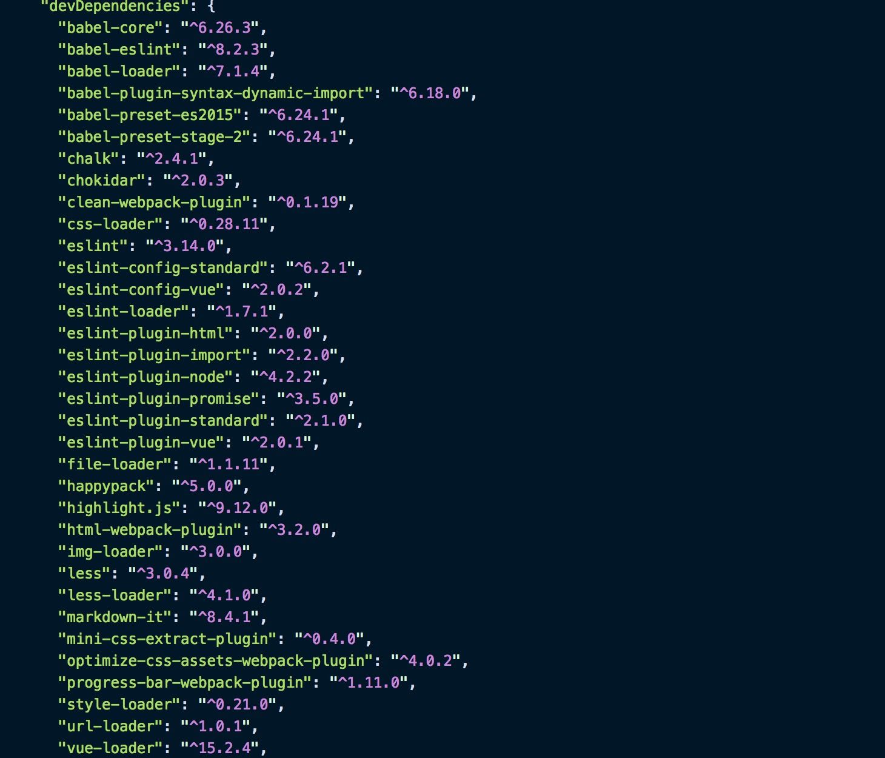
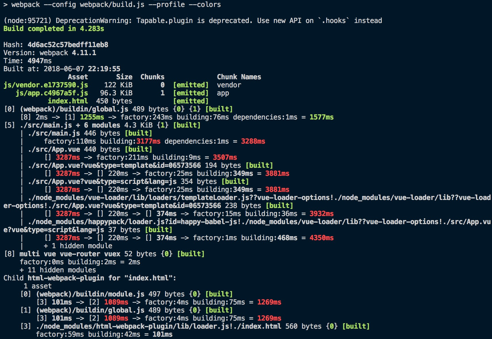
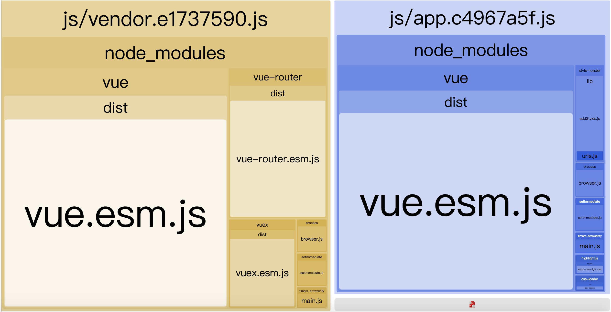

## Webpack打包优化—以blog站点开发为例

前段花了时间阅读了部分的webpack的源码，意识到webpack对于前端开发的重要性，于是下定决心，以开发一个blog为例，记录我学习webpack打包优化的心得。

当今打包工具众多，诸如`grunt`，`gulp`，`rollup`，`webpack`，`parcel`... webpack从中脱颖而出，各大框架基本都基于webpack做了自己的cli。本人开发技术栈为vue、react，之前一直都是使用官方scaffold，并没有花心思研究webpack，因为现在遇到了相关的需求，导致一发不可收拾。

blog的webpack版本为：`4.11.1`

### 初构webpack配置

配置中引用的包如图




配置`webpack.base.config.js`

```
const happyThreadPool = Happypack.ThreadPool({ size: os.cpus().length })
const createHappyPlugin = (id, loaders) => {
    return new Happypack({
        id,
        loaders,
        threadPool: happyThreadPool
    })
}
module: {
    rules: [
    {
        test: /\.js$/,
        loader: 'eslint-loader',
        exclude: /node_modules/
    },
    {
        enforce: 'pre',
        test: /\.vue$/,
        loader: 'eslint-loader',
        exclude: /node_modules/
    },
    {
        test: /\.js$/,
        loader: 'happypack/loader?id=happy-babel-js',
        exclude: '/node_modules/',
        include: [resolve('src')]
    },
    {
        test: /\.css$/,
        use: [
            env !== 'production' ? 'style-loader' : MiniCssExtractPlugin.loader,
            'css-loader'
        ]
    },
    {
        test: /\.less$/,
        use: [
            env !== 'production' ? 'style-loader' : MiniCssExtractPlugin.loader, // create style nodes from js string
            'css-loader', // translate css into commonjs
            'less-loader' // compile less to css
    	]
    },
    {
        test: /\.(png|jpe?g|gif|svg)(\?.*)?$/,
        loader: 'url-loader',
        options: {
            limit: 10000,
            name: 'img/[name].[hash:8].[ext]'
        }
    },
    {
        test: /\.(woff2?|eot|ttf|otf)(\?.*)?$/,
        loader: 'url-loader',
        options: {
            limit: 10000,
            name: 'fonts/[names].[hash:8].[ext]'
        }
    },
    {
        test: /\.md$/,
        loader: 'happypack/loader?id=happy-md',
        options: markdown
    },
    {
        test: /\.vue$/,
        loader: 'vue-loader',
        include: [resolve('src')],
        exclude: /node_modules/,
        options: {
            loaders: {
                css: [
                    env !== 'production' ? 'vue-style-loader' : MiniCssExtractPlugin.loader
                ],
                less: [
                    env !== 'production' ? 'vue-style-loader' : MiniCssExtractPlugin.loader,
                    'less-loader'
                ]
            }
    	}
    }
    ]
},
plugins: [
    new ProgressBarPlugin({
        format: '  build [:bar]' + chalk.green.bold(':percent') + ':elapsed seconds'
    }),
    // make sure to include the plugin for the magic
    new VueLoaderPlugin(),
    createHappyPlugin('happy-babel-js', ['babel-loader']),
    createHappyPlugin('happy-md', ['vue-markdown-loader']),
    // eslint-loader seem to try to access this.options which was removed.
    new webpack.LoaderOptionsPlugin({ options: {} })
],
resolve: {
    extensions: ['.vue', '.js', '.json'],
    modules: [
    	resolve('src'),
    	'node_modules'
    ],
    alias: {
        'vue$': 'vue/dist/vue.esm.js',
        '@': resolve('src')
    }
}
```

配置`webpack.dev.config.js`

```
mode: 'development',
entry: {
	app: './src/main.js'
},
output: {
    filename: 'js/[name].js',
    path: resolve('dist'),
    publicPath: '/'
},
devtool: '#cheap-module-eval-source-map',
devServer: {
    contentBase: resolve('/'),
    compress: true,
    hot: true,
    inline: true,
    publicPath: '/',
    port: '1574',
    stats: 'minimal',
    host: 'localhost'
},
plugins: [
    new webpack.optimize.ModuleConcatenationPlugin(),
    new webpack.HotModuleReplacementPlugin(),
    new webpack.NamedModulesPlugin(),
    new HtmlWebpackPlugin({
        filename: 'index.html',
        template: 'index.html',
        inject: true,
        chunks: ['app']
    })
]
```

配置`webpack.build.config.js`

```
mode: 'production',
// v1.0 vendor include vue/vue-router/vuex
entry: {
    'app': './src/main.js',
    'vendor': [
        'vue',
        'vue-router',
        'vuex'
    ]
},
output: {
    path: resolve('my-blog'),
    publicPath: '/my-blog/',
    filename: 'js/[name].[chunkhash:8].js',
    chunkFilename: 'js/[id].[chunhash:8].js'
},
// 用以下配置也行
// optimization: {
//     minimizer: [
//         new ParallelUglifyPlugin({
//             cache: true,
//             sourceMap: true
//         }),
//         new OptimizeCSSAssetsPlugin({})
//     ]
// },
plugins: [
    // scope hoisting(作用域提升)
    new webpack.optimize.ModuleConcatenationPlugin(),
    // extract css into its own file
    new MiniCssExtractPlugin({
    	filename: 'css/[name].[contenthash:8].css'
    }),
    // compress extracted css.
    new OptimizeCSSAssetsPlugin({}),
    new webpack.LoaderOptionsPlugin({
        minimize: true,
        debug: false
    }),
    // replace 'uglifyjs-webpack-plugin'
    new ParallelUglifyPlugin({
        cacheDir: '.cache/',
        uglifyJS: {
            output: {
                comments: false,
                beautify: false
            },
            compress: {
                warnings: false,
                drop_console: true,
                collapse_vars: true
            }
        }
    }),
    new HtmlWebpackPlugin({
        filename: 'index.html',
        template: 'index.html',
        inject: true,
        minify: {
            removeComments: true,
            collapseWhitespace: true,
            removeAttributeQuotes: true
        },
        chunks: ['vendor', 'app'],
        chunksSortMode: 'dependency'
    })
]
```

这个版本中，使用到`happypack`、`mini-css-extract-plugin`、`optimize-css-assets-plugin`、`webpack-parallel-uglify-plugin`、`ModuleConcatenationPlugin`

- happypack：定义happypack/loader?id=xx和创建Happypack({id}) plugin，用id关联。将原来的单进程loader执行，扩展为多进程模式，提高编译速度

- mini-css-extract-plugin：与extract-text-webpack-plugin相比，官方文档描述：

  1. Async loading
  2. No duplicate compilation(performance)
  3. Easier to use
  4. Specific to CSS
  5. support HMR in the future

  标配using preloaded or inlined CSS, Extracting all CSS in a single file, 还可以 extracting CSS based on entry, prevent the CSS duplication issue one  had with the ExtractTextPlugin(以后会试试)

  ```
  function recursiveIssuer(m) {
      if (m.issuer) {
          return recursiveIssuer(m.issuer)
      } else if (m.name) {
          return m.name
      } else {
          return false
      }
  }
  ...
  entry: {
      foo: resolve('src/foo'),
      bar: resolve('src/bar')
  },
  optimization: {
      splitChunks: {
          cacheGroups: {
              fooStyles: {
                  name: 'foo',
                  test: (m, c, entry='foo') => m.constructor.name === 'CssModule' && recursiveIssuer(m) === entry,
                  chunks: 'all',
                  enforce: true
              },
              barStyles: {
                  name: 'bar',
                  test: (m, c, entry='bar') => m.constructor.name === 'CssModule' && recursiveIssuer(m) === entry,
                  chunks: 'all',
                  enforce: true
              }
          }
      }
  }
  ```

- optimize-css-assets-webpack-plugin：optimize/minimize the CSS，solve duplicate CSS.

- webpack-parallel-uglify-plugin：顾名思义，就是提升编译速度的升级版的webpack-uglify-plugin，功能一致。

- ModuleConcatenationPlugin：原先每个bundle都独立在一个闭包中，处理速度会减弱。webpack结合了rollup和closure Compiler将所有模块通过定义变量的方式提到一个闭包中，提升了代码的执行速度，俗称作用域提升(scope hoisting)。**注意：**使用作用域提升，必须要用ECMAScript模块语法（es6）。

#### 总结

在第一版中，使用了变量提升了编译后文件运行速度；使用了happypack、mini-css-extract-plugin、optimize-css-assets-webpack-plugin、webpack-parallel-uglify-plugin提升了编译速度。

存在很大的问题，因为实际整个真实的代码就只有短短的几行，却打包出了vendor(122kb),app(96kb)。这是觉得不能忍的，缺少`externals`、`Dllplugin`、`DllReferencePlugin`、`Tree shaking`、`split chunks`、`dynamic import`，接下来要一一加上。

上打包后的体积图



同时，由于是第一次搭webpack配置，还是碰到几个问题，顺带记录下

1. 

   原因：[webpack升级到4.0后，已经将全局变量全部局部化，获取需要通过LoaderOptionsPlugin的方式定义全局变量才行，而eslint-loader还是采用原来的方式获取全局中的options，因此获取不到](https://github.com/webpack/webpack/issues/6556)

2. 

   原因：eslint升级到4.0.0以上后，eslint-plugin-html和eslint之间会有冲突，总之我是降版本解决，附上版本号

   

### 优化之analyz

优化第一步，先用webpack-bundle-analyzer或者别的类似的功能插件做分析，第一版的分析结果如下



WTF，vue居然两边都打包了！先处理这个问题

第一步，先把vendor中的vue、vue-router、vuex单独拆开，只是修改了entry的vendor和html-webpack-plugin中的引入模块


