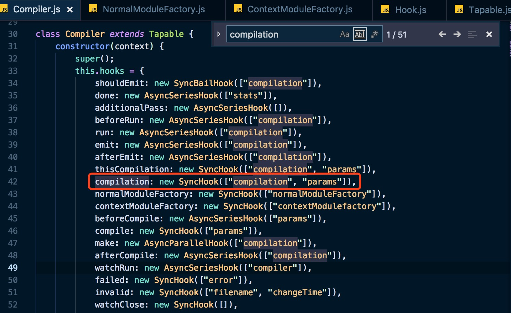
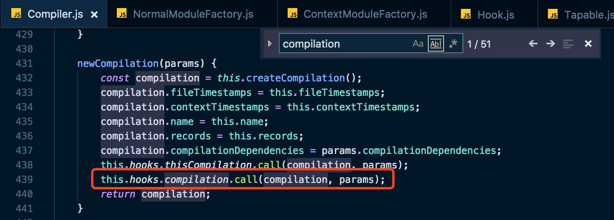
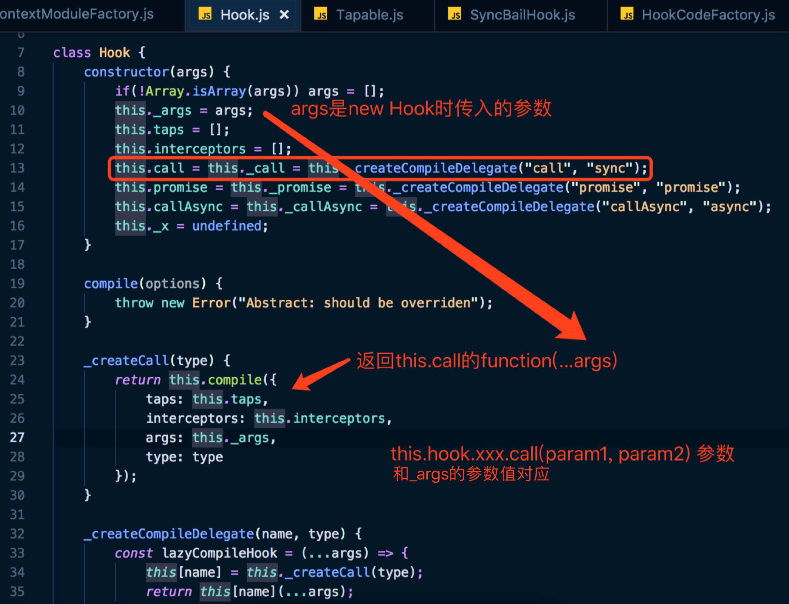

## webpack学习源码记录

1. 从核心入手，Tapable - (get)
2. 接下来详细阅读compiler，compilation两个继承类 - (get)
3. 学习如何编写plugin - (get)
4. 学习如何编写loader
5. 学习HMR原理
6. 理解bundle，如何生成chunks，需要理解AST、acorn  - (get)
7. 理解plugin执行原理  - (get)
8. 理解loader执行原理
9. 理解resolver是如何实现的，即如何查找对应文件所在的全路径
10. 对感兴趣的插件，loader学习源码
11. 动手写几个插件，loader
12. webpack更新速度惊人，跟着作者的步伐，尽量也能在源码中找到你的代码段

#### Webpack 源码调试

全局安装node-nightly

```
npm install --global node-nightly
```

安装完成后，执行

```
node-nightly
```

此时会下载nightly cli包，安装完成后才可以使用

接下来运行以下命令，Chrome Devtools会在chrome://inspect内产生可以断点调试的inspect链接

```
node-nightly --inspect-brk ./node_modules/webpack/bin/webpack.js
```

--inspect-brk 标记会自动给脚本第一句打断点，可以在源代码中设置断点调试

#### Webpack 4源码中的代码段理解图

#####compiler、compilation、hook



webpack.js 在最开始会new Compiler实例，创建compiler实例的hook，理解后面参数的含义，参数为hook执行call/callAsync/promise时，绑定的钩子的执行函数的参数，一一对应。也就是这里定义了几个变量，tap绑定的函数就可以传入几个参数



this.hooks.compilation.call(compilation, params)中的两个参数即为传入钩子函数的参数值



该代码段为Tapable的Hook.js，实际无论是compiler，compilation，resolver都是继承于Tapable，也就是都会执行这些方法，this.hooks.compilation.call即调用的就是`this.call = this._call = this.createCompileDelegate("call", "sync")`


Hook总共有10种类型，分为异步和同步两大类；异步包括并发执行和串行执行


create的返回值为函数方法，this.call(params)的执行方法